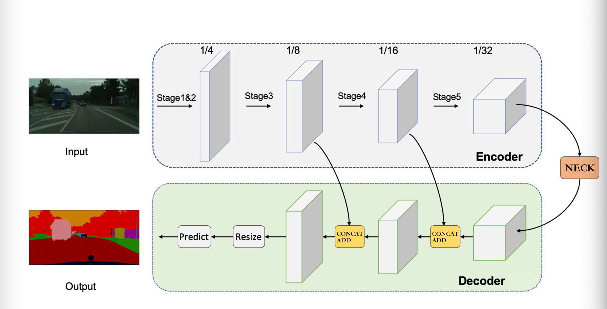

# 网络的设计使用  
这个网络是[模型](https://github.com/shengdewu/TrainFramework/blob/master/doc/model.md)中的`g_model`成员  
<br>

- `设计原理` 在语义分割模型中，所有的模型几乎都可以被认为是`编码解码结构`

    

<br>  

## 网络设计 [`EncoderDecoder`]

- 网络必须由 编码器， 解码器， 辅助网络`[可选]`， 瓶颈网络`[可选]`实现

- 继承 torch.nn.Module  

- 最终分割输出结果  

    - 如果输出通道等于1  调用 sigmod
    - 如果输出通道大于1  调用 softmax  

- 成员

    | name | type | 描述 |
    |---|---|---|
    | decoder | torch.nn.Module | 编码器 |
    | decoder | torch.nn.Module | 解码器 |
    | auxiliary | torch.nn.Module | 辅助器 |
    | neck | torch.nn.Module | 瓶颈器 |

    - 成员设计 主要是针对 `decoder`, `auxiliary` 这些需要计算损失函数的成员  

        - 成员方法

            - `forward_train` 前向推理，计算损失函数  
              
                | name | type | 描述 |
                |---|---|---|
                |img| torch.Tensor | 图像数据 |
                |img_meta | dict | 图像信息 <br> eg 图像原始大小，图像scale, 图像padding|    
                |gt_semantic_seg | torch.Tensor | 分割的gt图|   

            - `forward_test` 前向推理，计算推理结果  
              
                | name | type | 描述 |
                |---|---|---|
                |img| torch.Tensor | 图像数据 |

            - `lossse` 计算损失函数  

                | name | type | 描述 |
                |---|---|---|
                |img| torch.Tensor | 图像数据 |
                |img_meta | dict | 图像信息 <br> eg 图像原始大小，图像scale, 图像padding|    
                |gt_semantic_seg | torch.Tensor | 分割的gt图|  

        - 成员变量      

            - `loss`  
            
                参考[TrainFramework的loss](https://github.com/shengdewu/TrainFramework/blob/master/doc/loss.md) 创建  

    - 编码器和瓶颈器 直接继承 torch.nn.Module  

<br>

 
-  函数  

    - ` __init__ `   

        构造骨干网，瓶颈层，解码器， 辅助网络
        
        - 参数 包括网络参数，损失函数参数

            |name | type | 描述 |
            |---|---|---|
            |decoder_cfg| dict | 编码器配置 <br> eg 输入通道，输出通达， 步长，卷积核 |  
            |decoder_cfg| dict | 解码器配置, 包含损失函数 |
            | neck_cfg| dict | 瓶颈器配置，为了更好的利用主干网的特征 |  
            | auxiliary_cfg | dict | 辅助器配置，包含损失函数 |  
            
    - `extract_feature`  
        通过主干网、瓶颈层(如果有)提取编码特征, 为后续的解码器和辅助网络(如果有)服务    

        - 参数  

            | name | type | 描述 |
            |---|---|---|
            |img | torch.Tensor| 输入图片，数据增强后的结果 |  

    - ` forward_train `  
        
        调用 extract_feature, 解码器, 辅助网络，计算损失函数
        
        `不做 sigmod 或者 softmax， 由损失函数完成`

        - 参数
        
            | name | type | 描述 |
            |---|---|---|
            |img| torch.Tensor | 图像数据，通过[数据增强](https://github.com/shengdewu/TrainFramework/blob/master/doc/data_aug.md) 的输出结果 |
            |img_meta | dict | 图像信息 <br> eg 图像原始大小，图像scale, 图像padding|    
            |gt_semantic_seg | torch.Tensor | 分割的gt图|     
             
    - ` forward_test `  

        调用extract_feature， 解码器，获取最终结果[和推理图像的尺寸一致]<br>

        `根据情况做 sigmod 或者 softmax`  
        
        - 参数  
        
            | name | type | 描述 |
            |---|---|---|
            |img| torch.Tensor | 图像数据，通过[数据增强](https://github.com/shengdewu/TrainFramework/blob/master/doc/data_aug.md) 的输出结果 |
            |img_meta | dict | 图像信息 <br> eg 图像原始大小，图像scale, 图像padding|     


<br>  

- 示例  

    ```pytyon
    from engine.model import BUILD_NETWORK_REGISTRY
    from engine.model.build import build_network
    import torch.nn as nn
    from typing import Optional, Dict


    @BUILD_NETWORK_REGISTRY.register()
    class EncoderDecoer(nn.Module):
        def __init__(self, 
            decoder_cfg:Dict, 
            encoder_cfg:Dict, 
            neck_cfg:Optional[Dict]=None, 
            auxiliary_cfg:Optional[Dict]=None
        ):
            self.decoder = build_network(decoder_cfg)
            self.encoder = build_network(encoder_cfg)
            if neck_cfg is not None:
                self.neck = build_network(neck_cfg)
            if auxiliary_cfg is not None:
                self.auxiliary = build_network(auxiliary_cfg)
            return

        def extract_feature(self, img:torch.Tensor):
            x = self.encoder(img)
            if hasatrr(self, 'neck'):
                x = self.neck(x)
            return x

        def forward_train(self, 
            img:torch.Tensor, 
            img_meta:Dict, 
            gt_semantic_seg: torch.Tensor) -> Dict[str, torch.Tensor]:
            
            x = self.extract_feature(img)

            losses = self.decoder.forward_train(x)

            if hasattr(self, 'auxiliary'):
                loss_aux = self.auxiliary.forward_train(x)

            losses.update(loss_aux)

            return losses


        def forward_test(self, img:torch.Tensor) -> torch.Tensor:
            
            x = self.extract_feature(img)

            return self.decoder.forward_test(x)

    ```
    

## 目前实现了以下语义分割网络  

- [x] [RegSeg48](../config/base/model/regseg48.py) (Boundary-Aware Segmentation Network for
Mobile and Web Applications)  

- [x] [BiSeNet V2](../config/base/model/bisenetv2.py) (BiSeNet V2: Bilateral Network with Guided Aggregation for Real-time Semantic Segmentation)  

- [x] [DDRnet](../config/base/model/regseg48.py)(Deep Dual-resolution Networks for Real-time and Accurate Semantic Segmentation of Road Scenes)  

- [x] [ENet](../config/base/model/regseg48.py)(ENet: A Deep Neural Network Architecture for Real-Time Semantic Segmentation)  

- [x] [ppliteseg](../config/base/model/regseg48.py)(PP-LiteSeg: A Superior Real-Time Semantic Segmentation Model)  

- [x] [SegFormer](../config/base/model/regseg48.py)(SegFormer: Simple and Efficient Design for Semantic Segmentation with Transformers)   

- [x] [STDC](../config/base/model/stdc1.py)(Rethinking BiSeNet For Real-time Semantic Segmentation)  

- [x] [BASNet](../config/base/model/basnet.py)(BASNet: Boundary-Aware Salient Object Detection)  
 

<br>  


